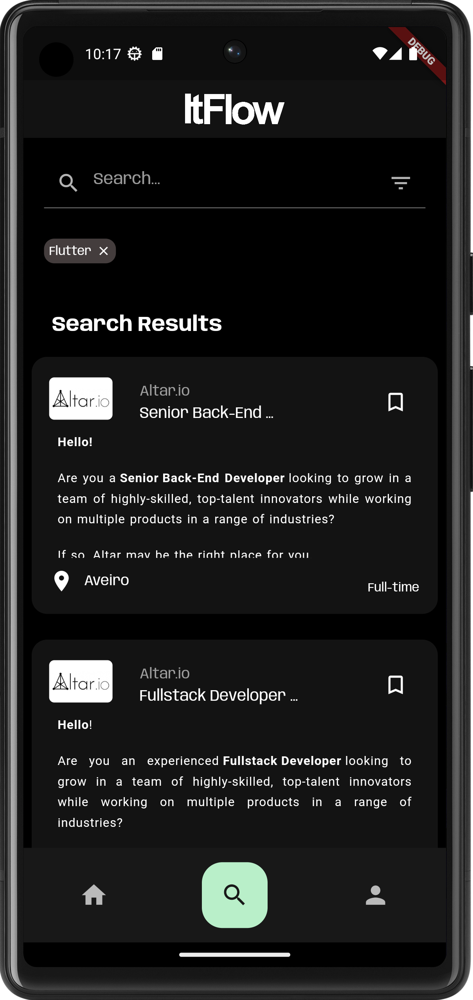

# _**ITFlow**_ Development Report

Welcome to the documentation pages of the _ITFlow_!

* Business modeling 
  * [Product Vision](/docs/ProductVision.md)
  * [Elevator Pitch](/docs/ElevatorPitch.md)
* [Requirements](/docs/requirements.md)
  * [Domain model](/docs/requirements.md)
* [Architecture and Design](/docs/ArchitectureAndDesign.md)
  * [Logical architecture](/docs/ArchitectureAndDesign.md#logical-architecture)
  * [Physical architecture](/docs/ArchitectureAndDesign.md#physical-architecture)
  * [Vertical prototype](/docs/ArchitectureAndDesign.md#vertical-prototype)
* [Test](/docs/Test.md)
* [Project management](/docs/ProjectManagement.md)

Here are some screenshots of the application:

  
  
  
  
  
  

- Adriano Alexandre dos Santos Machado
- Igor Cherstnev
- José Pedro Evans de Carvalho Nobre João
- Luís Filipe da Silva Jesus
- Henrique Filipe Pereira da Silva Caridade

---

