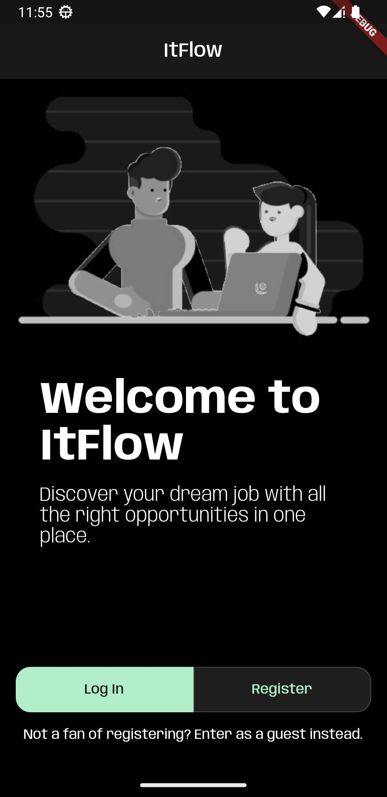
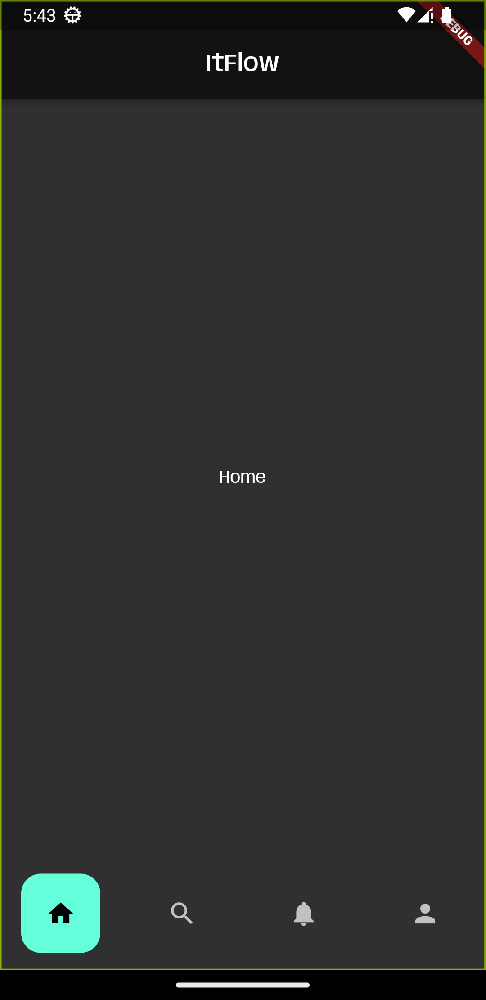
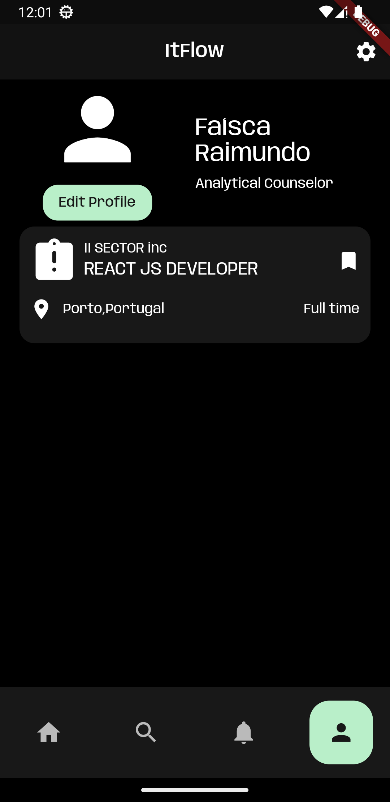

## Architecture and Design
### Logical architecture
To provide long-term maintainability, the structure of the software is going to be organized in the following layers:
- **Components**: the main building blocks that will be used to present the user interface, such as buttons, custom widgets, etc.
- **Screens**: the screens that will be used to present the user interface, such as the login screen, the home screen, etc. Screens will be composed of components.
- **Controller**: will be responsible for data gathering and manipulation, such as fetchers, parsers, neworking (e.g: login/register ), etc.
- **Model**: will be responsible for the structure of the data, such as the user model, the job model, etc, using the data collected by the controller. 

### Physical architecture
In our app's physical architecture there are 4 main entities:
- **User's smartphone**: the user's smartphone will be the main device used to access the app. It will be used to display the app's interface and to interact with it.
- **ITFlow App**: the app will be the main entity of the system. It will be responsible for the user interface and for the interaction with the user.
- **Firebase Database**: the database will be used to store different information, such as in-app job posting.
- **ITJobs API**: the API will be used to fetch job offers from an external source.

### Vertical prototype

The following features were implemented:
- A start screen with buttons to navigate to the login screen and the register screen;
 

- A draft of the navigation between the screens using the bottom navigation bar;
 

- A draft of the job seeker's profile screen;
 

