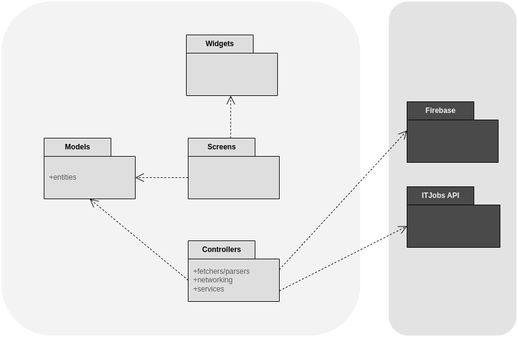
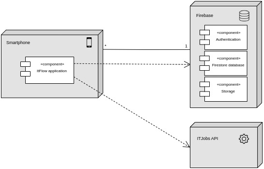

## Architecture and Design
### Logical architecture
To provide long-term maintainability, the structure of the software is going to be organized in the following layers:
- **Widgets**: the main building blocks that will be used to present the user interface, such as buttons, forms, and other composed widgets that require more than one widget to be built.
- **Screens**: the screens that will be used to present the user interface, such as the login screen, the home screen, etc. Screens will be composed of widgets.
- **Controllers**: this is responsible for data gathering and manipulation, such as fetchers, parsers, neworking (e.g: login/register ), etc. This layer will be responsible for the retrieval of data from Firebase and the ItJobs API as well as will serve as a data validator, for example, to check the validity of some user's input.
- **Models**:  this is responsible for the structure and encapsulation of the data, such as the user model, the job model, etc. Basically, this layer is responsible for the abstraction of the problem domain to the software domain, by defining the entities involved, their attributes and their methods.

In addition to these layers that are organized in folders inside the `lib` folder, there are two others: 'Constants' and 'Theme'. However, we decided not to include them in the diagram below because they are not layers, but rather folders that contain files that are used by the other layers. The 'Constants' folder contains files that define constants that are used by the other layers, such as the routes to the screens. The 'Theme' folder contains files that define the theme of the app, such as the colors, the fonts, etc.

Below is a diagram that illustrates the logical architecture of our app. The light boxes represent our in-app layers, while the dark boxes represent external entities that we will interact with (Firebase and ItJobs API):

### Physical architecture
In our app's physical architecture there are 4 main entities:
- **Smartphone**: the user's smartphone will be the main device used to access the app. It will be used to display the app's interface and to interact with it. It's there where the app will be installed and executed.
- **ITFlow application**: the app will be the main entity of the system. It will be responsible for the user interface and for the interaction with the user. Note that the app is not a physical entity, but rather a logical one.
- **Firebase**: this is the service that is used to store the user's data, such as the user's profile, the user's bookmarked job offers, etc. This unit is made up of different components that correspond to the different services that Firebase provides and we are using, such as the Authentication service, the Firestore service and the Storage service (for images and other files).
- **ITJobs API**: the API that is used to retrieve the job offers that are displayed in the app. 

### Vertical prototype

The following features were implemented:
- A start screen with buttons to navigate to the login screen and the register screen;
 

- A draft of the navigation between the screens using the bottom navigation bar;
 

- A draft of the job seeker's profile screen;
 

We are currently working with FIGMA to design our prototype. Here's a link to our current project: https://www.figma.com/file/ITJGuCmmKHlOhnb4bvyrCV/IT-Flow-prototype?node-id=191%3A231&t=ZK66NVF5PD1d4Mfm-1
