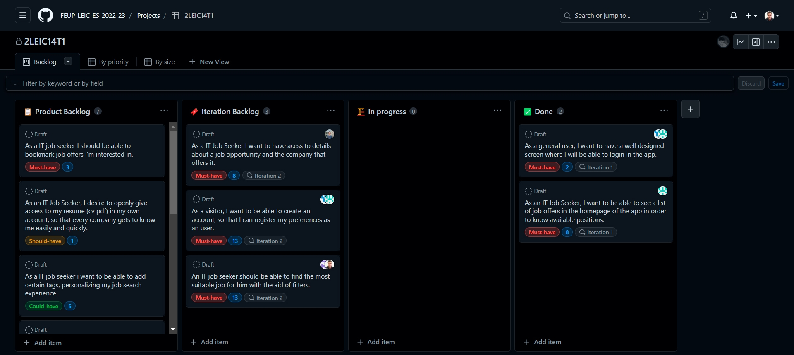
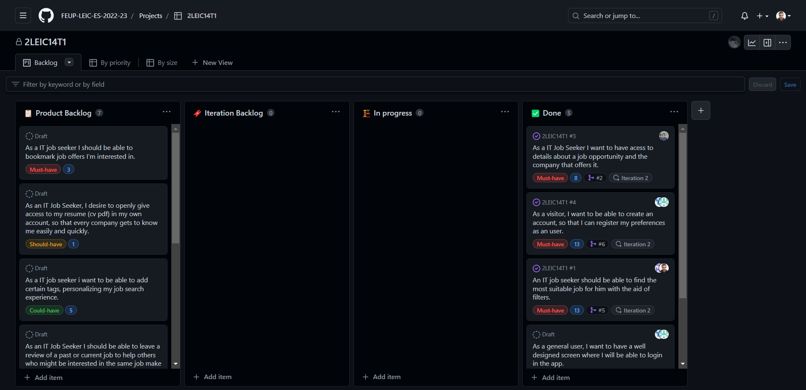
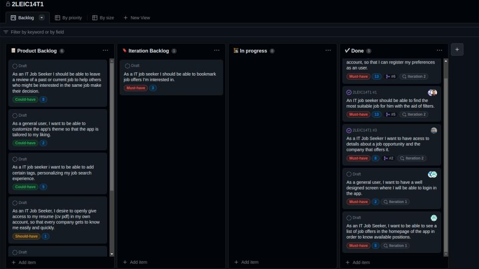
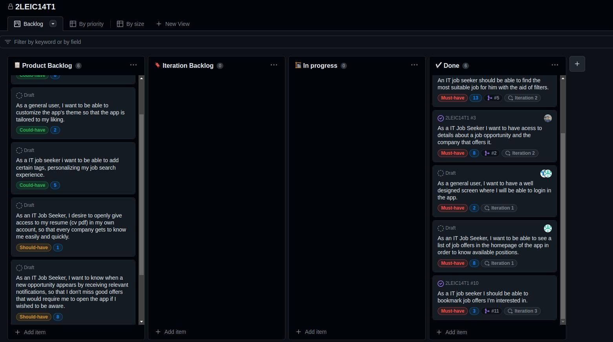
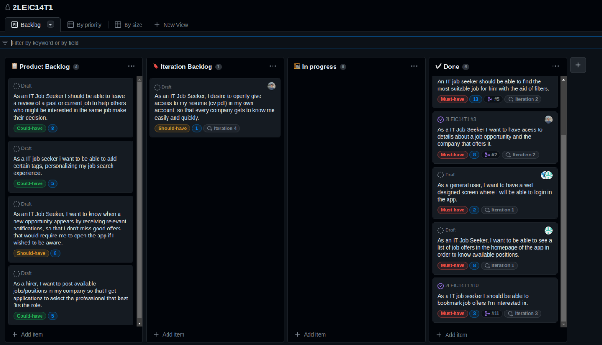
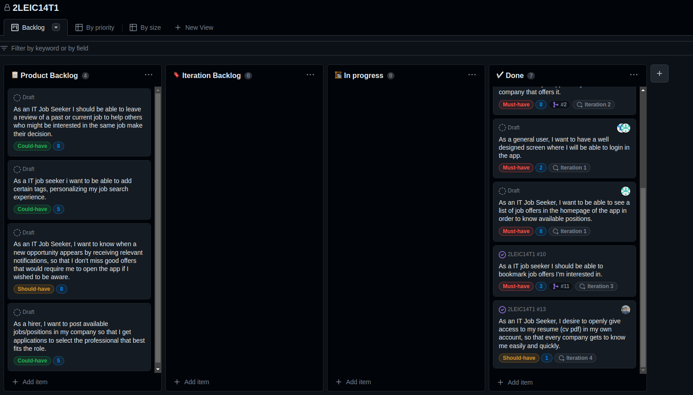

## Project management

## **Iteration 1**

Begin of iteration:

End of iteration:

**Retrospective**: we were not able to complete all the user stories. We could have make a better planning of issues, such as assigning specific people to specific user stories. However, we were able to complete relevant user stories. Also, it was the first iteration in which we had to write code so we were still getting used to the tools and the workflow.

## **Iteration 2**

Begin of iteration:

End of iteration:

**Retrospective**: we were able to complete all the user stories. We could have make a better planning of issues, such as assigning only one person to a specific user story. This iteration went really well and we implemented most of the main features of the app, allowing a good navigation and interaction with it in a early stage of the development.

## **Iteration 3**

Begin of iteration:

End of iteration:

**Retrospective**: this iteration was very complicated due to the fact that we were kind of lost and unsychronized because of other deliveries and exames. Considering this, we could only implement one user story, that was the only one we had put in the iteration backlog because we already knew that the time would be short. The feature is, however, quite nice for the app and provides an extra functionality that fits well in the app.
We are worried because, probably, we will not be able to implement all the user stories we have planned in the beginning of the project, as the next two weeks will be caotic in terms of other deliveries.

## **Iteration 4**

Begin of iteration:

End of iteration:

**Retrospective**: as we were expecting, this iteration was very complicated considering that in the previous iterations the work should have been more distributed. We implemented the user story that we defined in the begining of the iteration, however a couple of others still stayed in the backlog waiting to be implemented.

 
 

# General Retrospective

In general, we consider that that the app we are delivering, even though is not completed as we wanted it to be, has a nice amount of features and deals with all the tools and concepts that the course was expecting us to apply such as: the integration with an external database (Firebase), the integration with an API to retrieve data (It Jobs), a nice design using Flutter, and a very good lesson in terms of work flow and organization in a team. 

Considering that, at a certain point (end of iteration 3), we noticed that we wouldn't be able to finish what we wanted, we decided to focus on improving the already existing features (such as the search filters, for example). We don't think, though, that we didn't reach what we have proposed because of lack of work. The main reason is because initially we didn't know much about the tools we'd be using. Thus, we submitted an exigent proposal of project (different types of users, with different functionalities for each, etc). As we didn't know, by that time, the implementation details and the exact amount time we'd need to spend on each feature, we ended up discovering that we would probably fail the implementation of all the features during the near-end development. However, it is true that with a better plan this could have been better. 

Unfortunately, we also weren't able to implement relevant testing in our app because we were more worried in delivering the features.

To conclude, we are not completely satisfied with the final result of the app, but we are proud of what we have achieved and we are sure that we have learned a lot with this project. If we forget the initial proposal and think about the app we have now, we consider that is still an app with potential that can be improved in the future and it is, for sure, a good starting point for a future project. Also, it is functional in its main features and domain (only lacking the functionalities we did not implement and some improvements in the existing ones).
