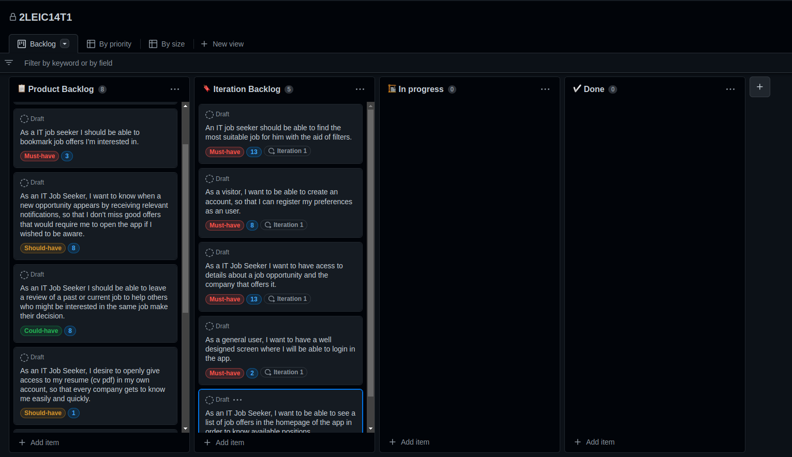
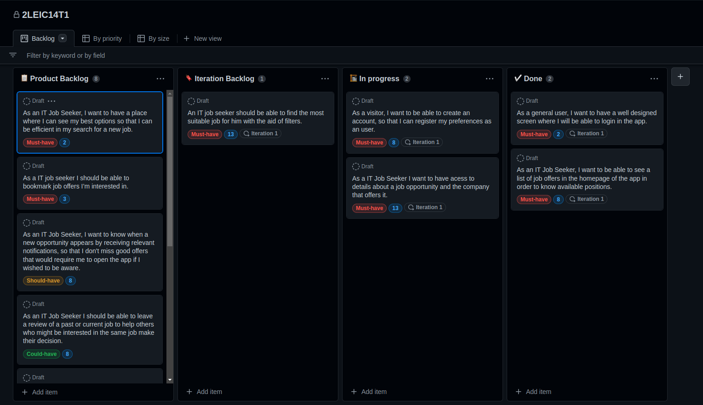

## Project management

**Iteration 1**

Begin of iteration:

End of iteration:

**Retrospective**: we were not able to complete all the user stories. We could have make a better planning of issues, such as assigning specific people to specific user stories. 

 
