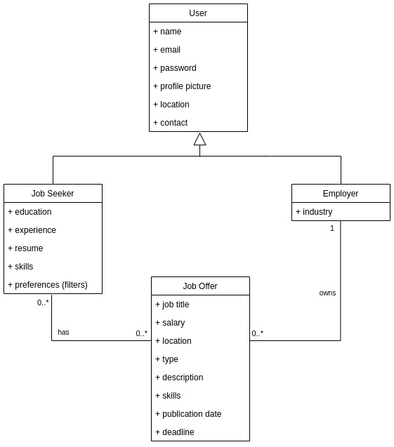

## Requirements

In this section, you should describe all kinds of requirements for your module: functional and non-functional requirements.

### Domain model

 

  

### Classes and Interactions
##
- **User**: represents a user of the app. It has the following attributes:
  - name;
  - email;
  - password;
  - profile picture;
  - location;
  - contact;
##
- **Job Seeker**: derives from User. It has the following attributes:
  - education: such as degree, institution, etc;
  - experience: years of experience;
  - resume;
  - skills: such as programming languages, frameworks, etc to match with job offers;
  - preferences (filters): such as location, salary, etc to match with job offers with those preferences.
  ##
  A job seeker has many job offers at his/her disposal and job offers are at the disposal of many job seekers.
##
- **Employer**: derives from User. It has the following attributes:
  - industry: specific IT industry, such as software development, data science, automation, etc.
  ##
  A employer owns many job offers and a job offer belongs to a specific employer.
##
- **Job Offer**: represents a job offer. It has the following attributes:
  - job title: such as software developer, data scientist, etc;
  - salary;
  - location;
  - type: such as full-time, part-time, etc;
  - description;
  - skills: to match with job seekers with those skills;
  - publication date;
  - deadline.
  ##
  A job offer has many job seekers looking for it and and is associated with an employer.
