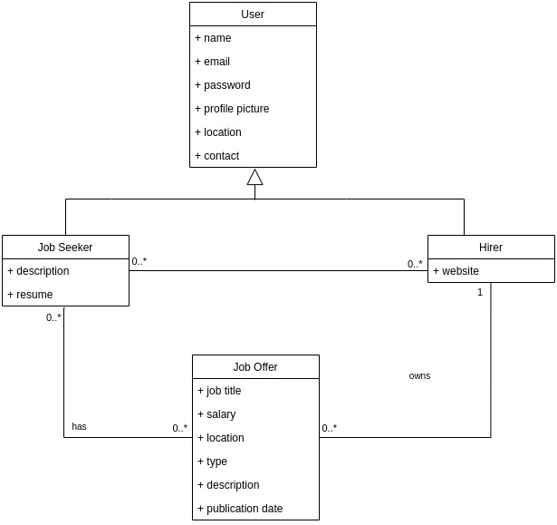

## Requirements

In this section, you should describe all kinds of requirements for your module: functional and non-functional requirements.

### Domain model

 

  

### Classes and Interactions
##
- **User**: represents a user of the app. It has the following attributes:
  - name;
  - email;
  - password;
  - profile picture;
  - location;
  - contact;
##
- **Job Seeker**: derives from User. It has the following attributes:
  - description;
  - resume;
  ##
  A job seeker has many job offers at his/her disposal and job offers are at the disposal of many job seekers. 
##
- **Employer**: derives from User. It has the following attributes:
  - website;
  ##
  A employer owns many job offers and a job offer belongs to a specific employer.
##
- **Job Offer**: represents a job offer. It has the following attributes:
  - job title: such as software developer, data scientist, etc;
  - salary;
  - location;
  - type: such as full-time, part-time, etc;
  - description;
  - publication date;
  ##
  A job offer has many job seekers looking for it and and is associated with an employer.

Note that this is a high-level description and representation of the domain model. However, the app itself has more classes and maybe different attributes in some of them. This is just an overview to show the idea behind the app and the main interaction and relations are here represented.